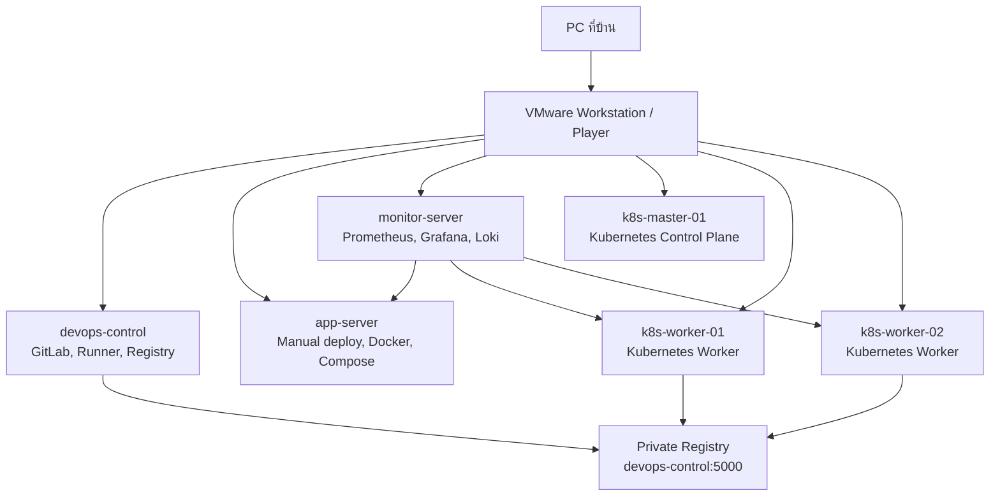
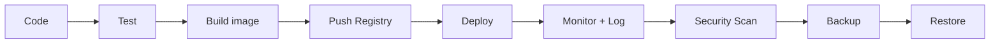

# DevOps Lab ภาษาไทยบน VMware

Repository นี้เป็นชุดเอกสารสำหรับฝึก DevOps แบบลงมือทำจริงบนเครื่อง PC ที่บ้าน โดยใช้ VMware Workstation หรือ VMware Player จำลองสภาพแวดล้อมหลายเครื่อง เช่น GitLab server, application server, monitoring server และ Kubernetes cluster

เนื้อหาหลักอยู่ในโฟลเดอร์ [lessons](./lessons) โดยเริ่มอ่านจาก [lessons/README.md](./lessons/README.md)

Lab นี้ออกแบบเพื่อการเรียนรู้และ troubleshooting ในเครื่องส่วนตัว ไม่ใช่ production hardening เต็มรูปแบบ บางจุดจึงใช้ค่าแบบง่าย เช่น HTTP registry หรือ image ของเครื่องมือแบบ `latest` เพื่อให้เริ่มได้เร็ว เมื่อเอาแนวคิดไปใช้จริงควรเพิ่ม HTTPS, authentication, access control, version pinning, backup policy และ security policy ให้เหมาะกับระบบจริง

## เกี่ยวกับ Lab นี้

เอกสารนี้ออกแบบมาสำหรับผู้ที่มีพื้นฐาน Fullstack Developer แล้ว และต้องการต่อยอดไปสู่สาย DevOps Engineer, Cloud Engineer, Platform Engineer หรือ SRE ผ่านการฝึกกับระบบจำลองที่ใกล้เคียงงานจริง

Lab จะพาฝึกตั้งแต่พื้นฐาน Linux server, network, service, log และ firewall ไปจนถึงการ deploy application ด้วย Nginx, Docker, Docker Compose, GitLab CI/CD, Terraform, Monitoring, Logging, Kubernetes, Helm, Security scan และ Backup/Restore

## ระดับของเอกสาร

เอกสารนี้อยู่ระดับ Junior ถึงต้น Mid-level DevOps ในเชิงทักษะปฏิบัติ เหมาะสำหรับคนที่ต้องการเข้าใจ workflow ตั้งแต่ code ไปจนถึงระบบที่ deploy, monitor, debug, secure และ restore ได้

สิ่งที่เอกสารนี้ช่วยให้ทำได้:

- เข้าใจพื้นฐาน Linux, network, service, log และ troubleshooting
- สร้าง flow พื้นฐานของ DevOps ตั้งแต่ build image, push registry, CI/CD, deploy เข้า Kubernetes และตรวจระบบ
- ใช้เครื่องมือหลักในสาย DevOps ได้พอเข้าใจบทบาทและจุดตรวจสอบ
- เตรียมพื้นฐานสำหรับสมัครหรือทำงานระดับ Junior DevOps, Cloud/Infra junior, Platform junior หรือ Fullstack Developer ที่ต้องดูแล deployment เอง

สิ่งที่ยังไม่ใช่ขอบเขตหลักของเอกสารนี้:

- Production Kubernetes แบบ HA
- Cloud architecture จริงบน AWS, Azure หรือ GCP
- GitOps เต็มรูปแบบ
- Secret management ระดับองค์กร
- Observability ที่มี alert, tracing, SLO/SLI ครบ
- Security hardening, RBAC, policy และ compliance แบบ production
- Backup/DR automation ระดับ production

ถ้าต้องการขยับไป Mid-level หรือสูงกว่า ให้ดูบท [แนวทางเรียนต่อ](./lessons/26-next-steps.md) หลังทำ Lab ครบ

## สิ่งที่จะได้ฝึก

- เตรียม VM และติดตั้ง Ubuntu Server
- ตั้งค่า hostname, static IP, SSH และ `/etc/hosts`
- ใช้งาน Linux, systemd, journalctl และคำสั่งตรวจสอบ resource
- ตรวจ network, DNS, port และ firewall ด้วย UFW
- Deploy API แบบ manual ด้วย Node.js, systemd และ Nginx reverse proxy
- เขียน Dockerfile และรัน container
- ใช้ Docker Compose สำหรับ fullstack application
- สร้าง Private Container Registry
- วาง Git Flow, tag และ release version
- ทำ CI/CD ด้วย GitLab CE และ GitLab Runner
- เข้าใจ Infrastructure as Code ด้วย Terraform
- เก็บ metrics ด้วย Prometheus และแสดงผลผ่าน Grafana
- รวม log ด้วย Loki และ Promtail
- สร้าง Kubernetes cluster ด้วย kubeadm
- Deploy application เข้า Kubernetes ด้วย Deployment, Service และ Ingress
- ใช้ ConfigMap, Secret, Storage และ Helm Chart
- ทำ DevSecOps เบื้องต้นด้วย Trivy
- ทดสอบ Backup, Restore และแนวคิด DR

## ภาพรวม Architecture

```text
PC ที่บ้าน
└── VMware Workstation / Player
    ├── devops-control     : GitLab, Registry, เครื่องควบคุม
    ├── app-server         : Deploy app แบบ VM/Docker
    ├── monitor-server     : Prometheus, Grafana, Loki
    ├── k8s-master-01      : Kubernetes Control Plane
    ├── k8s-worker-01      : Kubernetes Worker
    └── k8s-worker-02      : Kubernetes Worker
```



## เครื่องมือหลัก

- Ubuntu Server 22.04 LTS หรือ 24.04 LTS
- VMware Workstation หรือ VMware Player
- Nginx
- Node.js
- Docker และ Docker Compose
- GitLab CE และ GitLab Runner
- Terraform
- Prometheus, Grafana, Loki และ Promtail
- Kubernetes, kubeadm, kubectl และ Helm
- Trivy

## โครงสร้างเนื้อหา

เอกสารแบ่งเป็น 18 Lab พร้อม Final Project, Checklist, Troubleshooting และภาคผนวกคำสั่งที่ควรจำ

หัวข้อสำคัญประกอบด้วย:

- Lab 01-03: พื้นฐาน VM, Linux, SSH, Network และ Firewall
- Lab 04-08: Manual deploy, Docker, Docker Compose, Registry และ Git Flow
- Lab 09-12: CI/CD, Terraform, Monitoring และ Logging
- Lab 13-16: Kubernetes cluster, application deployment, Ingress, ConfigMap, Secret, Storage และ Helm
- Lab 17-18: DevSecOps, Backup, Restore และ DR
- Final Project: นำ Fullstack App ของตัวเองมาทำเป็น DevOps project ครบวงจร

## วิธีใช้งาน

เปิดอ่านเอกสารแบบแยกบทจากโฟลเดอร์:

```text
lessons/
```

แนะนำให้ทำ Lab ตามลำดับ เพราะแต่ละบทต่อยอดจากพื้นฐานก่อนหน้า เช่น Kubernetes ต้องอาศัยความเข้าใจ Linux, network, container runtime และ registry ที่ทำไว้ในบทก่อน

## ผลลัพธ์หลังทำครบ

เมื่อทำ Lab ครบ คุณควรเข้าใจ flow งาน DevOps ตั้งแต่ต้นทางถึงปลายทาง:

```text
Code
-> Build
-> Test
-> Package as Image
-> Push Registry
-> Deploy
-> Monitor
-> Log
-> Secure
-> Backup
-> Restore
```



และสามารถนำความรู้ไปต่อยอดกับงาน DevOps, Cloud, Platform Engineering หรือ SRE ได้ง่ายขึ้น โดยเฉพาะถ้ามีพื้นฐานการพัฒนา Fullstack application อยู่แล้ว
