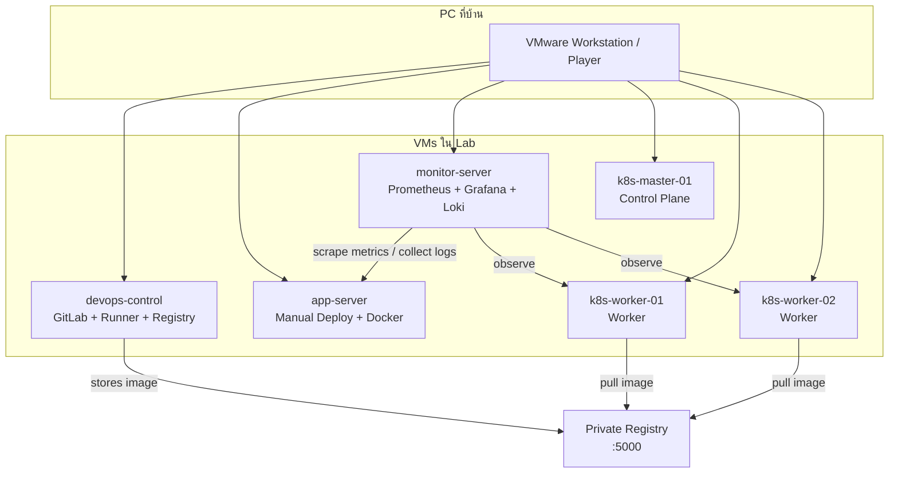
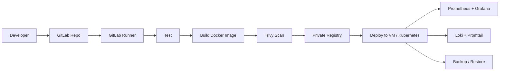

# 1. ภาพรวม Lab

## เป้าหมาย

หลังทำ Lab นี้จบ คุณควรทำสิ่งเหล่านี้ได้:

- ติดตั้งและดูแล Linux Server เบื้องต้น
- ตรวจสอบ SSH, Service, Process, Port, DNS และ Firewall
- Deploy Web/API ด้วย Nginx และ Systemd
- เขียน Dockerfile และ Docker Compose
- สร้าง Private Container Registry
- ทำ Git Flow, Tag และ Release Version
- ทำ CI/CD Pipeline ด้วย GitLab CI
- ใช้ Terraform เพื่อเข้าใจ Infrastructure as Code
- เก็บ Metrics ด้วย Prometheus และแสดงผลด้วย Grafana
- รวม Log ด้วย Loki และ Promtail
- สร้าง Kubernetes Cluster บน VMware
- Deploy App เข้า Kubernetes พร้อม Service, Ingress, ConfigMap, Secret
- ใช้ Helm สำหรับจัดการ Kubernetes Manifest
- Scan Security ด้วย Trivy
- Backup และ Restore ระบบเบื้องต้น

เป้าหมายเหล่านี้ไม่ได้แยกเป็นเรื่อง ๆ แบบต่างคนต่างอยู่ แต่เป็น flow เดียวกันของงาน DevOps จริง เริ่มจากการมี server ที่ติดต่อกันได้ จากนั้น deploy app ให้รันได้ ทำให้ app ถูก package เป็น image ทำ pipeline ให้ build/test/deploy ได้อัตโนมัติ แล้วค่อยเพิ่มส่วนที่ทำให้ระบบดูแลได้จริง เช่น monitoring, logging, security scan และ backup

ถ้าทำครบ คุณควรไม่ได้แค่รู้ว่า “ใช้คำสั่งอะไร” แต่ควรรู้ว่าแต่ละเครื่องมืออยู่ตรงไหนในระบบ และถ้าเครื่องมือนั้นพังจะกระทบอะไร เช่น GitLab ล่มจะกระทบ pipeline, Registry เข้าไม่ได้จะกระทบการ pull image, Prometheus scrape ไม่ได้จะกระทบการมองเห็น metrics แต่ไม่ได้ทำให้ app หยุดทำงานทันที

## ภาพรวมสิ่งที่จะสร้าง

Lab นี้จะจำลอง environment ขนาดเล็กบนเครื่องเดียว โดยใช้หลาย VM เพื่อแยกหน้าที่ให้ใกล้เคียงระบบจริง:

- `devops-control` เป็นเครื่องควบคุม ใช้เก็บ Git repository, run GitLab CI/CD และเป็น private container registry
- `app-server` เป็นเครื่องสำหรับทดลอง deploy app แบบ manual และ Docker ก่อนย้ายแนวคิดไป Kubernetes
- `monitor-server` เป็นเครื่องสำหรับเก็บ metrics และ log เพื่อให้เห็นสถานะระบบ
- `k8s-master-01` เป็น control plane ของ Kubernetes ใช้ควบคุม cluster
- `k8s-worker-01` และ `k8s-worker-02` เป็น worker node สำหรับรัน workload

การแยกแบบนี้ทำให้เห็น dependency ระหว่างระบบชัดขึ้น ตัวอย่างเช่น app อาจรันอยู่บน worker node แต่ image ที่ใช้รันถูกเก็บใน `devops-control` และ metrics ถูกเก็บโดย `monitor-server` ถ้า network ระหว่างเครื่องผิด ระบบจะมีอาการที่ดูเหมือน app พัง ทั้งที่จริงอาจเป็นปัญหา routing, DNS หรือ firewall

## ภาพรวม Architecture

```text
PC ที่บ้าน
└── VMware Workstation / Player
    ├── devops-control     : GitLab, Registry, เครื่องควบคุม
    ├── app-server         : Deploy app แบบ VM/Docker
    ├── monitor-server     : Prometheus, Grafana, Loki
    ├── k8s-master-01      : Kubernetes Control Plane
    ├── k8s-worker-01      : Kubernetes Worker
    └── k8s-worker-02      : Kubernetes Worker
```



## Flow การทำงานที่ต้องเข้าใจ

ภาพรวมการทำงานของ Lab เมื่อประกอบครบจะประมาณนี้:

```text
Developer push code
-> GitLab รับ code
-> GitLab Runner run test/build
-> build Docker image
-> push image เข้า Private Registry
-> deploy ไปยัง VM หรือ Kubernetes
-> Prometheus/Grafana ตรวจ metrics
-> Loki/Promtail รวม log
-> Trivy scan security
-> Backup/Restore ใช้กู้ระบบเมื่อเกิดปัญหา
```



สิ่งสำคัญคือทุกขั้นมีจุดตรวจสอบของตัวเอง อย่าแก้ปัญหาข้ามชั้น เช่น ถ้า deploy แล้ว app เข้าไม่ได้ ควรตรวจว่า container หรือ pod รันอยู่ไหม, service เปิด port หรือยัง, DNS/hosts ชี้ถูกไหม, firewall block หรือเปล่า และ log ของ app มี error อะไร ไม่ควรสรุปทันทีว่า Kubernetes หรือ Docker พัง

## ตัวอย่างการมองปัญหา

ตัวอย่างที่ผิด:

```text
อาการ: เข้าเว็บไม่ได้
สรุปทันที: Kubernetes พัง
ทำต่อ: ลบ cluster แล้วสร้างใหม่
```

ปัญหาของแนวทางนี้คือกว้างเกินไปและเสี่ยงทำลายข้อมูลหรือ config ที่ไม่ได้เกี่ยวกับสาเหตุจริง

ตัวอย่างที่ถูก:

```text
อาการ: เข้าเว็บไม่ได้
ตรวจทีละชั้น:
1. DNS หรือ hosts resolve ไป IP ถูกไหม
2. port เปิดอยู่ไหม
3. service หรือ ingress ชี้ backend ถูกไหม
4. pod/container running หรือไม่
5. app log มี error อะไร
6. image และ config/env ถูกต้องไหม
```

แนวทางนี้ช้ากว่าในครั้งแรก แต่ทำให้หา root cause ได้แม่นกว่า และเป็นทักษะสำคัญของ DevOps/SRE

## สิ่งที่ควรได้จากบทภาพรวม

ก่อนเริ่ม Lab 01 ควรตอบได้ว่า:

- VM แต่ละเครื่องมีหน้าที่อะไร
- ทำไมต้องมี private registry
- monitoring กับ logging ต่างกันอย่างไรในภาพรวม
- CI/CD อยู่ตรงไหนของ flow
- Kubernetes จะถูกใช้หลังจากเข้าใจ Docker และ registry แล้ว
- ถ้าเกิดปัญหา ควรไล่ตรวจจาก layer ใดบ้าง

ถ้าภาพรวมนี้ยังไม่ชัด ให้ย้อนอ่าน architecture และ flow อีกครั้งก่อนเริ่มสร้าง VM เพราะการวาง lab ให้เป็นระบบตั้งแต่ต้นจะลดเวลาการแก้ปัญหาในบทหลังอย่างมาก

---

<!-- lesson-nav:start -->

---

## บทนำทาง

- บทก่อนหน้า: [DevOps Lab ภาษาไทย สำหรับจำลองบน VMware ที่บ้าน](./00-introduction.md)
- สารบัญ: [DevOps Lab Lessons](./README.md)
- บทเรียนถัดไป: [2. สเปกเครื่องและ Network ที่แนะนำ](./02-recommended-specs-and-network.md)

<!-- lesson-nav:end -->
