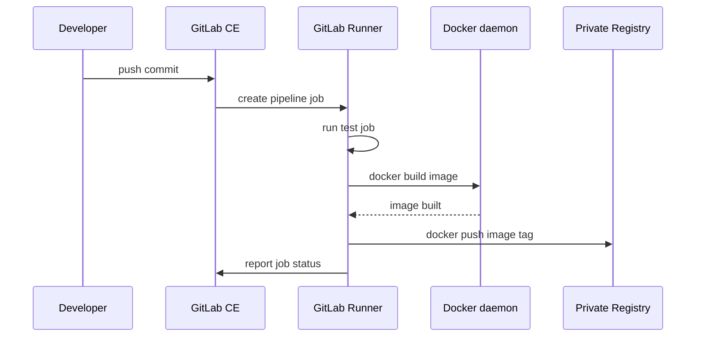

# 12. Lab 09: CI/CD ด้วย GitLab CE และ GitLab Runner

Lab นี้นำ Git, Docker และ Private Registry มาต่อกันเป็น pipeline อัตโนมัติ เป้าหมายคือเมื่อ push code เข้า GitLab แล้วระบบจะทดสอบ, build Docker image, push image เข้า registry และเตรียมขั้น deploy โดยไม่ต้องรันคำสั่งด้วยมือทุกครั้ง

## วัตถุประสงค์

- ติดตั้ง GitLab CE แบบ container
- ตั้ง GitLab Runner
- เขียน `.gitlab-ci.yml`
- build และ push image เข้า registry

ภาพรวมการทำงาน:

```text
Developer push code
-> GitLab รับ commit
-> GitLab สร้าง pipeline จาก .gitlab-ci.yml
-> GitLab Runner รับ job ไปรัน
-> test job ตรวจ code
-> build job สร้าง Docker image
-> push image เข้า devops-control:5000
-> deploy job เตรียม deploy ไป environment
```



GitLab CE คือ web application สำหรับจัดการ repository และ pipeline ส่วน GitLab Runner คือ worker ที่รับ job จาก GitLab ไปรันจริง ถ้ามี GitLab แต่ไม่มี Runner pipeline จะถูกสร้างได้แต่ไม่มีเครื่องรัน job

## ติดตั้ง GitLab CE บน devops-control

```bash
mkdir -p ~/gitlab/{config,logs,data}
docker run -d \
  --hostname devops-control \
  --name gitlab \
  --restart always \
  -p 8081:80 \
  -p 2222:22 \
  -v ~/gitlab/config:/etc/gitlab \
  -v ~/gitlab/logs:/var/log/gitlab \
  -v ~/gitlab/data:/var/opt/gitlab \
  gitlab/gitlab-ce:latest
```

คำสั่งนี้รัน GitLab CE เป็น container บน `devops-control`:

- `--hostname devops-control` ตั้ง hostname ภายใน GitLab ให้สอดคล้องกับ lab
- `-p 8081:80` เปิด GitLab web UI ที่ port 8081 ของ host
- `-p 2222:22` เปิด SSH ของ GitLab ที่ port 2222 เพื่อไม่ชนกับ SSH ของ VM ที่ port 22
- `~/gitlab/config` เก็บ config
- `~/gitlab/logs` เก็บ log
- `~/gitlab/data` เก็บ repository และข้อมูล GitLab

GitLab ใช้ RAM และ CPU ค่อนข้างมาก หลัง start ครั้งแรกอาจต้องรอหลายนาทีกว่าจะพร้อมใช้งาน ตรวจสถานะได้ด้วย:

ใน Lab นี้ใช้ `gitlab/gitlab-ce:latest` เพื่อให้ติดตั้งง่าย แต่ถ้าต้องการให้ lab ทำซ้ำได้เหมือนเดิมทุกครั้ง ควร pin version ของ GitLab CE เป็น tag ที่ชัดเจน เช่น `gitlab/gitlab-ce:<version>` และจด version นั้นไว้ใน note ส่วนตัว

```bash
docker logs -f gitlab
docker ps
curl -I http://localhost:8081
```

ถ้าเครื่อง RAM น้อย GitLab อาจ start ช้าหรือ restart เอง ให้ตรวจ `docker logs gitlab` และ resource ด้วย `free -h`, `top`

ดู password root:

```bash
docker exec -it gitlab grep 'Password:' /etc/gitlab/initial_root_password
```

password เริ่มต้นนี้มีอายุจำกัดตาม GitLab version บางรุ่น และควรเปลี่ยนหลัง login ครั้งแรก อย่า commit password หรือ token ลง repository

เข้าใช้งาน:

```text
http://devops-control:8081
```

ถ้าเข้า URL ไม่ได้ ให้ไล่ตรวจ:

```bash
getent hosts devops-control
docker ps | grep gitlab
ss -tulpen | grep ':8081'
sudo ufw status numbered
curl http://localhost:8081
```

ถ้า `localhost:8081` บน `devops-control` ได้ แต่เครื่องอื่นเข้า `devops-control:8081` ไม่ได้ ปัญหามักอยู่ที่ hostname, firewall หรือ network ระหว่างเครื่อง

## ติดตั้ง GitLab Runner

```bash
docker run -d --name gitlab-runner --restart always \
  -v /srv/gitlab-runner/config:/etc/gitlab-runner \
  -v /var/run/docker.sock:/var/run/docker.sock \
  gitlab/gitlab-runner:latest
```

Runner container นี้ mount 2 จุดสำคัญ:

เช่นเดียวกับ GitLab CE การใช้ `gitlab/gitlab-runner:latest` เหมาะกับ lab เริ่มต้น แต่ถ้าต้องการความนิ่งควร pin version ให้ตรงกับ GitLab ที่ใช้

- `/srv/gitlab-runner/config:/etc/gitlab-runner` เก็บ config runner ถาวร
- `/var/run/docker.sock:/var/run/docker.sock` ให้ job ที่รันใน runner สั่ง Docker daemon ของ host ได้

การ mount Docker socket ทำให้ pipeline build image ได้ง่าย แต่มีสิทธิ์สูงมาก เพราะ job สามารถควบคุม Docker daemon บน host ได้ ใน lab นี้รับได้เพื่อความเข้าใจ แต่ production ควรออกแบบ runner security ให้รัดกุมกว่า เช่น dedicated runner, protected branch/tag, จำกัด project ที่ใช้ runner ได้ หรือใช้ Docker-in-Docker อย่างระวัง

Register runner จาก GitLab UI แล้วเลือก executor เป็น docker

ขั้นตอนโดยภาพรวม:

1. เข้า GitLab UI
2. สร้าง project สำหรับ simple-api
3. ไปที่ Settings > CI/CD > Runners
4. สร้างหรือดู registration token ตาม GitLab version ที่ใช้
5. register runner จาก container หรือ UI flow
6. เลือก executor เป็น `docker`
7. ตั้ง default image เช่น `alpine:latest` หรือ image ที่เหมาะกับ job

ตรวจ runner:

```bash
docker logs gitlab-runner
docker exec -it gitlab-runner gitlab-runner list
```

ถ้าใช้ Docker executor และต้องการให้ job build/push image ผ่าน Docker socket ให้ตรวจไฟล์ config ของ runner ด้วย:

```bash
sudo grep -n "volumes" /srv/gitlab-runner/config/config.toml
```

ควรมี volume ของ Docker socket ถูกส่งเข้า job container เช่น:

```toml
volumes = ["/cache", "/var/run/docker.sock:/var/run/docker.sock"]
```

ถ้าไม่มี ให้แก้ `config.toml` แล้ว restart runner:

```bash
docker restart gitlab-runner
```

การ mount socket ที่ container ของ runner อย่างเดียวอาจยังไม่พอถ้า runner ไม่ส่ง socket เข้า job container ผ่าน `config.toml`

ถ้า pipeline ค้างที่ pending มักเกิดจาก runner ยังไม่ register, runner offline, tag ไม่ตรง หรือ project ไม่อนุญาตให้ใช้ runner นั้น

## ตัวอย่าง .gitlab-ci.yml

```yaml
stages:
  - test
  - build
  - deploy

variables:
  IMAGE_NAME: "devops-control:5000/simple-api"
  IMAGE_TAG: "$CI_COMMIT_SHORT_SHA"

test:
  stage: test
  image: node:20-alpine
  script:
    - npm ci
    - node -e "console.log('test passed')"

build:
  stage: build
  image: docker:latest
  script:
    - docker build -t $IMAGE_NAME:$IMAGE_TAG .
    - docker tag $IMAGE_NAME:$IMAGE_TAG $IMAGE_NAME:1.0.0
    - docker push $IMAGE_NAME:$IMAGE_TAG
    - docker push $IMAGE_NAME:1.0.0

deploy_dev:
  stage: deploy
  script:
    - echo "Deploy to dev server here"
  only:
    - main
```

ไฟล์ `.gitlab-ci.yml` คือ pipeline definition ที่ GitLab อ่านจาก repository ทุกครั้งที่มี commit

อธิบายส่วนสำคัญ:

- `stages` กำหนดลำดับกลุ่มงาน เช่น test ก่อน build ก่อน deploy
- `variables` กำหนดค่าที่ใช้ซ้ำในหลาย job
- `IMAGE_NAME` ชี้ไป private registry ที่สร้างใน Lab 07
- `IMAGE_TAG` ใช้ `$CI_COMMIT_SHORT_SHA` เพื่อให้ image tag trace กลับไป commit ได้
- `test` ใช้ Node image เพื่อรันคำสั่งทดสอบ
- `build` ใช้ Docker image เพื่อ build และ push container image
- `docker tag ... 1.0.0` เพิ่ม tag ตัวอย่างสำหรับใช้ต่อในบท Kubernetes ของ lab นี้ ถ้าใช้กับ release จริง ไม่ควรเขียนทับ `1.0.0` ทุก commit แต่ควรสร้าง tag ใหม่ตาม release เช่น `1.0.1`, `1.0.2` หรือใช้ `$CI_COMMIT_SHORT_SHA` แล้วแก้ manifest ให้ตรงกับ tag นั้น
- `deploy_dev` เป็น placeholder สำหรับ deploy จริงในบทต่อไป
- `only: main` จำกัดให้ deploy ทำเฉพาะ branch main

ข้อควรระวัง: ตัวอย่าง `build` job ต้องรันบน runner ที่เข้าถึง Docker daemon ได้ และ Docker daemon ต้องตั้ง insecure registry สำหรับ `devops-control:5000` แล้ว ไม่อย่างนั้น `docker push` จะ fail

ในตัวอย่างนี้ `docker:latest` เป็น image ของเครื่องมือที่ใช้ใน job ไม่ใช่ release tag ของ application ถ้าต้องการ lab ที่ reproducible มากขึ้น ให้ pin เป็น version ชัดเจน เช่น `docker:<version>` ส่วน application image ไม่ควรใช้ `latest` เป็น tag เดียว เพราะ rollback และ audit ยาก

ตัวอย่างที่ผิด:

```yaml
IMAGE_TAG: "latest"
```

ใช้ `latest` อย่างเดียวทำให้ไม่รู้ว่า image มาจาก commit ไหน

ตัวอย่างที่ถูก:

```yaml
IMAGE_TAG: "$CI_COMMIT_SHORT_SHA"
```

หรือใช้ Git tag สำหรับ release:

```yaml
IMAGE_TAG: "$CI_COMMIT_TAG"
```

## สิ่งที่ต้องเตรียมใน repository

ก่อน pipeline นี้จะรันผ่าน repository ต้องมีไฟล์ที่ build ได้ เช่น:

```text
Dockerfile
package.json
package-lock.json
index.js
.gitlab-ci.yml
```

ถ้า `npm ci` fail เพราะไม่มี `package-lock.json` ให้รัน `npm install` แล้ว commit lock file ก่อน

ถ้า Docker build fail ให้ลอง build บน server ด้วยมือก่อน:

```bash
docker build -t simple-api:test .
```

ถ้า build ด้วยมือยัง fail แปลว่าปัญหาอยู่ที่ Dockerfile/source ไม่ใช่ GitLab CI

## เรื่อง credentials และ registry

ใน lab นี้ private registry เป็น HTTP registry แบบไม่เปิด auth เพื่อให้เข้าใจ flow ก่อน ใน production ควรใช้ HTTPS และ authentication

ถ้า registry ต้อง login pipeline จะต้องมีตัวแปร เช่น:

```text
REGISTRY_USER
REGISTRY_PASSWORD
```

แล้วใช้ `docker login` ใน job โดยเก็บค่าผ่าน GitLab CI/CD Variables ไม่ใช่เขียน password ลง `.gitlab-ci.yml`

## การทดสอบ

- Push code เข้า GitLab
- Pipeline ต้องรันครบ stage
- Registry มี image tag ใหม่

ขั้นตอนทดสอบที่แนะนำ:

1. push code เข้า branch `main`
2. เปิด GitLab UI แล้วดู pipeline
3. ตรวจว่า job `test`, `build`, `deploy_dev` รันตามลำดับ
4. เปิด log ของแต่ละ job ถ้ามี error
5. ตรวจ registry ว่ามี image tag ใหม่

คำสั่งตรวจ registry:

```bash
curl http://devops-control:5000/v2/_catalog
curl http://devops-control:5000/v2/simple-api/tags/list
```

ถ้า pipeline ผ่านแต่ registry ไม่มี tag ใหม่ ให้ตรวจว่า build job push ไป registry/repository ถูกชื่อหรือไม่

## การตรวจสอบ

```bash
curl http://devops-control:5000/v2/_catalog
```

ตรวจ Runner และ Docker เพิ่ม:

```bash
docker ps | grep gitlab
docker ps | grep gitlab-runner
docker logs gitlab-runner
docker exec -it gitlab-runner gitlab-runner list
docker info | grep -A 5 "Insecure Registries"
```

ตัวอย่างปัญหาที่พบบ่อย:

```text
Pipeline pending
-> runner offline, ยังไม่ register, tag runner ไม่ตรง, หรือ project ใช้ runner ไม่ได้

docker: command not found
-> image ที่ใช้ใน job ไม่มี docker CLI หรือ runner config ไม่เหมาะ

Cannot connect to Docker daemon
-> runner ไม่ได้ส่ง /var/run/docker.sock เข้า job container ผ่าน config.toml หรือ permission ไม่พอ

server gave HTTP response to HTTPS client
-> Docker daemon ของ runner ยังไม่ได้ตั้ง insecure registry

npm ci fail
-> ไม่มี package-lock.json หรือ dependency ไม่ตรง
```

เวลา pipeline fail ให้เปิด job log ก่อนเสมอ เพราะ log จะบอกคำสั่งที่ fail และ exit code ชัดเจนกว่าเดาจากสถานะรวมของ pipeline

## ข้อสรุป

CI/CD ลดงาน manual และทำให้ทุก release มีประวัติ ตรวจสอบได้ และทำซ้ำได้

สิ่งที่ควรเข้าใจจากบทนี้:

```text
GitLab เก็บ code และ pipeline definition
Runner เป็นคนรัน job จริง
.gitlab-ci.yml กำหนด stage/job
Docker build สร้าง image
Registry เก็บ image
image tag ควร trace กลับไป commit หรือ release ได้
```

เมื่อ pipeline เริ่มนิ่งแล้ว ขั้นต่อไปคือทำให้ deploy จริง ไม่ใช่แค่ echo placeholder ซึ่งจะต่อยอดไปยัง Terraform, Monitoring และ Kubernetes ในบทถัดไป

---

<!-- lesson-nav:start -->

---

## บทนำทาง

- บทก่อนหน้า: [11. Lab 08: Git Flow และ Release Version](./11-lab-08-git-flow-release-version.md)
- สารบัญ: [DevOps Lab Lessons](./README.md)
- บทเรียนถัดไป: [13. Lab 10: Terraform และ Infrastructure as Code](./13-lab-10-terraform-iac.md)

<!-- lesson-nav:end -->
