# 22. Final Project

## เป้าหมาย

เอา Fullstack App ของคุณเองมาทำเป็น DevOps Project แบบครบวงจร

Final Project คือการรวมทุกบทที่ผ่านมาให้เป็นงานชิ้นเดียว ไม่ใช่แค่ deploy app ให้ขึ้น แต่ต้องแสดงให้เห็นว่า app นั้น build, test, package, scan, deploy, monitor, log, rollback และ restore ได้

ผลลัพธ์ที่ต้องตอบให้ได้:

```text
code อยู่ที่ไหน
build อย่างไร
image อยู่ registry ไหน
deploy ไป environment ไหน
monitor/log ดูที่ไหน
ถ้า deploy พัง rollback อย่างไร
ถ้าข้อมูลหาย restore อย่างไร
```

ถ้าตอบได้ครบ แปลว่า project เริ่มมีลักษณะของ DevOps workflow จริง

## Scope ที่แนะนำ

ใช้ app ที่ไม่ซับซ้อนเกินไป แต่มีองค์ประกอบพอให้ฝึกครบ:

- frontend 1 ตัว เช่น HTML/React/Vue/Angular
- backend 1 ตัว เช่น Node.js/Express, Python/FastAPI หรือภาษาอื่นที่ถนัด
- database 1 ตัว เช่น PostgreSQL
- endpoint health check เช่น `/health`
- endpoint ที่แตะ database อย่างน้อย 1 endpoint

อย่าเลือก business logic ใหญ่เกินไป เป้าหมายของ project นี้คือ DevOps workflow ไม่ใช่ feature application จำนวนมาก

## โครงสร้างที่แนะนำ

```text
my-devops-project/
├── frontend/
├── backend/
├── docker-compose.yml
├── nginx/
├── k8s/
│   ├── namespace.yaml
│   ├── deployment.yaml
│   ├── service.yaml
│   ├── ingress.yaml
│   ├── configmap.yaml
│   └── secret.yaml
├── helm/
├── terraform/
├── monitoring/
├── .gitlab-ci.yml
└── README.md
```

คำอธิบายแต่ละส่วน:

- `frontend/` source code และ Dockerfile ของ frontend
- `backend/` source code, test และ Dockerfile ของ backend
- `docker-compose.yml` ใช้รัน local/fullstack test
- `nginx/` reverse proxy config สำหรับ local หรือ VM deploy
- `k8s/` manifest พื้นฐาน
- `helm/` chart สำหรับ deploy แบบ package
- `terraform/` lab IaC หรือ config ที่เกี่ยวข้อง
- `monitoring/` dashboard, Prometheus/Loki notes หรือ config
- `.gitlab-ci.yml` pipeline หลัก
- `README.md` วิธีติดตั้ง, deploy, test, rollback และ restore

โครงสร้างนี้ปรับได้ตาม stack จริง แต่ควรแยกส่วนให้ชัด เพื่อให้คนอื่นอ่านแล้วเข้าใจว่า source, deploy config และ operation docs อยู่ตรงไหน

## Pipeline ที่ต้องการ

```text
Developer push code
-> test
-> build Docker image
-> scan image
-> push registry
-> deploy dev
-> manual approve
-> deploy prod/lab
-> monitor
-> rollback ได้
```



```mermaid
flowchart LR
    Dev["Developer"] --> Repo["GitLab Repo"]
    Repo --> Test["test"]
    Test --> Build["build Docker image"]
    Build --> Scan["scan image"]
    Scan --> Push["push registry"]
    Push --> DevDeploy["deploy dev"]
    DevDeploy --> Approval["manual approve"]
    Approval --> ProdDeploy["deploy prod/lab"]
    ProdDeploy --> Observe["monitor + log"]
    Observe --> Rollback["rollback if needed"]
```

pipeline ขั้นต่ำควรมี stage:

```yaml
stages:
  - test
  - build
  - security
  - push
  - deploy
```

แนวคิด:

- `test` ตรวจ code และ dependency
- `build` สร้าง Docker image
- `security` scan ด้วย Trivy
- `push` ส่ง image เข้า private registry
- `deploy` deploy ไป dev/lab environment

ถ้าทำ manual approval ได้ ให้ใช้กับขั้น deploy ที่เสี่ยงกว่า เช่น prod/lab หลัก เพื่อฝึก release control

## Requirement

- App run ได้บน local
- มี Dockerfile frontend/backend
- มี Docker Compose
- มี Private Registry
- มี GitLab repo
- มี CI/CD pipeline
- มี Trivy scan
- Deploy เข้า Kubernetes ได้
- มี Ingress
- มี ConfigMap/Secret
- มี Helm Chart
- มี Grafana Dashboard
- มี log ใน Loki
- มี backup/restore test
- README อธิบายวิธีติดตั้งและทดสอบครบ

## Phase การทำงาน

### Phase 1: ทำให้ app รันได้บน local

เป้าหมายคือให้ developer ใหม่ clone repo แล้วรันระบบได้ด้วยคำสั่งไม่กี่คำสั่ง

ตัวอย่าง:

```bash
docker compose up -d --build
curl http://localhost:8080/health
curl http://localhost:8080/api/db
```

ถ้า local ยังรันไม่ได้ อย่าเพิ่งทำ Kubernetes หรือ CI/CD เพราะ pipeline จะซับซ้อนขึ้นโดยยังไม่รู้ว่า app พื้นฐานถูกต้องหรือไม่

### Phase 2: ทำ Docker image และ registry

ต้องมี image tag ที่ trace กลับไป commit/release ได้:

```text
devops-control:5000/myapp-backend:<commit-sha>
devops-control:5000/myapp-frontend:<commit-sha>
```

หลีกเลี่ยงการใช้ `latest` เป็น tag เดียว เพราะ rollback และ audit ยาก

### Phase 3: ทำ CI/CD

pipeline ควรทำอย่างน้อย:

```text
run test
build image
scan image/source
push registry
deploy dev
```

ถ้า pipeline fail ต้องรู้ว่า fail ที่ stage ใด และเปิด job log เพื่อดูคำสั่งที่ fail ได้

### Phase 4: Deploy เข้า Kubernetes

เริ่มจาก manifest ใน `k8s/` ให้รันได้ก่อน แล้วค่อยย้ายเป็น Helm chart:

```bash
kubectl apply -f k8s/
kubectl get all -n <namespace>
```

หลังจากนั้นใช้ Helm:

```bash
helm upgrade --install myapp ./helm/myapp -n <namespace>
```

### Phase 5: Monitoring, Logging, Security และ Backup

ต้องมีหลักฐานว่า:

- Grafana เห็น metrics สำคัญ
- Loki query log ของ app ได้
- Trivy scan อยู่ใน pipeline หรือมี command scan ชัดเจน
- backup database ได้
- restore backup ได้จริงอย่างน้อย 1 ครั้ง

## Acceptance Criteria

ถือว่า project ผ่านเมื่อทำสิ่งเหล่านี้ได้จริง:

- [ ] clone repo แล้วอ่าน README เพื่อรัน local ได้
- [ ] `docker compose up -d --build` แล้ว frontend/backend/database ใช้งานได้
- [ ] GitLab pipeline รัน test/build/scan/push ได้
- [ ] image ถูก push เข้า private registry พร้อม tag ที่ trace ได้
- [ ] Kubernetes deployment มี pod Running และ Service เรียกได้
- [ ] Ingress เข้า app จาก browser/curl ได้
- [ ] ConfigMap/Secret ถูกใช้แทน hardcode config สำคัญ
- [ ] Helm chart deploy/upgrade/rollback ได้
- [ ] Grafana dashboard มีข้อมูลจริง
- [ ] Loki query log ของ app ได้
- [ ] Trivy scan แสดงผลและใช้เป็น gate อย่างน้อยระดับ CRITICAL
- [ ] มี backup file และ restore test ผ่าน
- [ ] README บอกวิธี deploy, test, rollback และ restore

## Demo Script

เตรียมลำดับ demo ไว้เพื่อพิสูจน์ว่า project ทำงานครบ:

```text
1. เปิด GitLab repo และ pipeline ล่าสุด
2. แสดง job test/build/scan/push/deploy
3. แสดง image tag ใน registry
4. kubectl get pods/services/ingress
5. curl หรือเปิด browser เข้า app
6. เปิด Grafana dashboard
7. Query log ใน Loki
8. แสดง helm history และทดลอง rollback หรืออธิบาย rollback path
9. แสดง backup file และผล restore test
```

การมี demo script ช่วยให้ตรวจ project ได้เป็นระบบ และทำให้เห็นช่องว่างทันทีว่าขั้นไหนยังไม่มีหลักฐาน

## README ของ Final Project ควรมีอะไร

README ใน project ควรตอบคำถาม operation ได้ ไม่ใช่มีแค่วิธี run app:

- ภาพรวม architecture
- prerequisite
- วิธี run local
- วิธี build image
- วิธี push registry
- วิธี deploy Kubernetes/Helm
- environment variables/config/secret ที่ต้องตั้ง
- วิธี run test
- วิธีดู logs และ metrics
- วิธี rollback
- วิธี backup/restore
- troubleshooting ที่พบบ่อย

ตัวอย่างที่ผิด:

```text
README มีแค่ npm install และ npm start
```

ตัวอย่างที่ถูก:

```text
README อธิบายตั้งแต่ local -> CI/CD -> registry -> Kubernetes -> monitor/log -> rollback/restore
```

## ข้อผิดพลาดที่ควรหลีกเลี่ยง

- ทำ Kubernetes ก่อน local/Docker Compose ยังไม่ผ่าน
- ใช้ image tag `latest` อย่างเดียว
- hardcode password ใน manifest
- pipeline deploy โดยไม่มี scan หรือ test
- มี dashboard แต่ไม่มีข้อมูลจริง
- มี backup แต่ไม่เคย restore
- README ไม่บอกวิธี debug หรือ rollback

Final Project ที่ดีไม่จำเป็นต้องซับซ้อน แต่ต้องทำซ้ำได้ ตรวจสอบได้ และกู้คืนได้

---

<!-- lesson-nav:start -->

---

## บทนำทาง

- บทก่อนหน้า: [21. Lab 18: Backup, Restore และ DR พื้นฐาน](./21-lab-18-backup-restore-dr.md)
- สารบัญ: [DevOps Lab Lessons](./README.md)
- บทเรียนถัดไป: [23. Checklist หลังเรียนจบ](./23-completion-checklist.md)

<!-- lesson-nav:end -->
